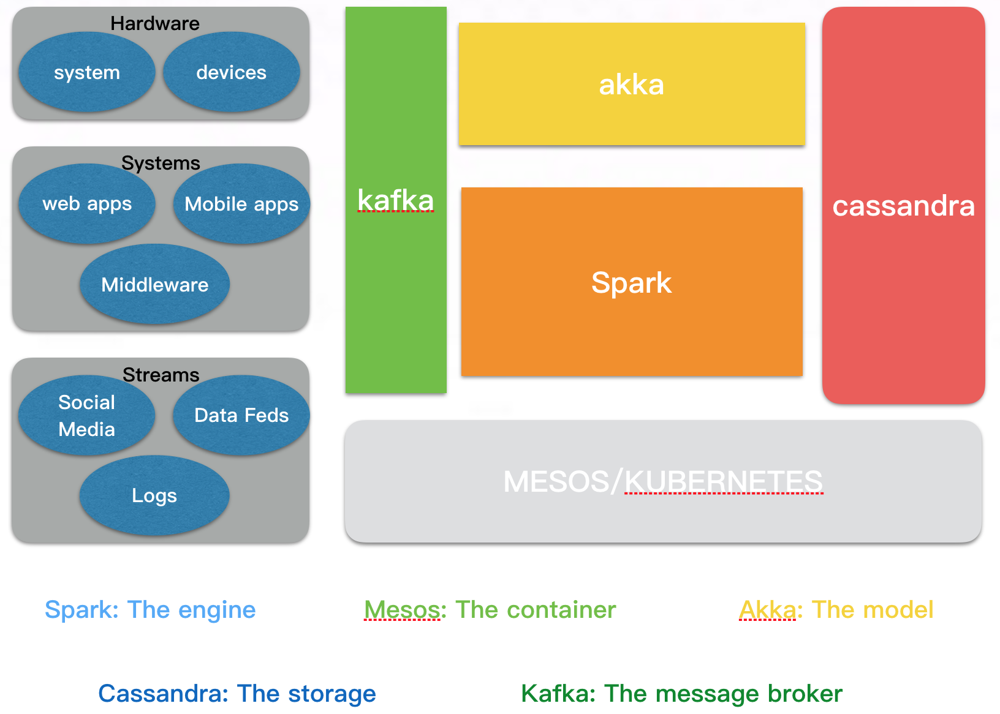
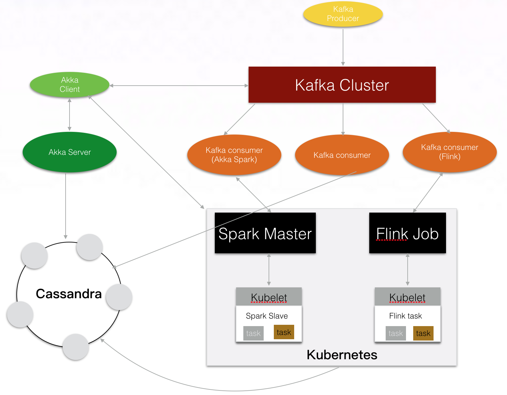
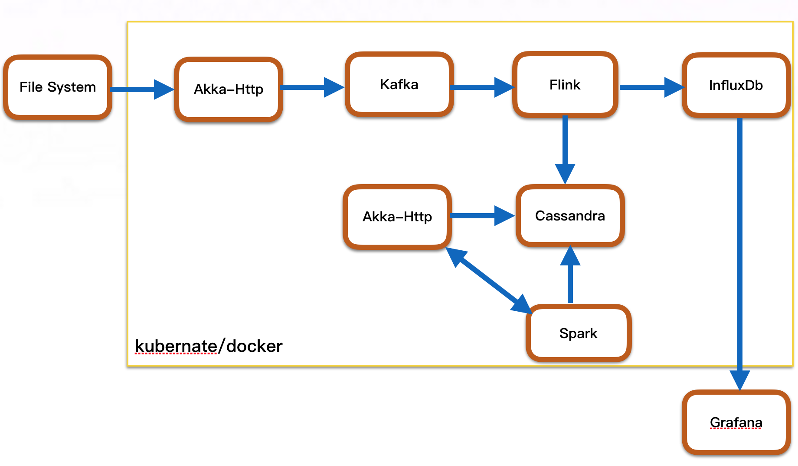

# 大数据－流式处理解决方案（SMACK/FkACK）－ v1.0

# 大数据挑战

*数据源的数量随着时间的推移而增加

*获取数据样本

*随着时间的推移，分析的有效性已经过时了

*分析的投资回报有关

# Lambda架构

    Lambda架构是数据处理架构，旨在通过采取批处理和流处理方法的优势来处理大规模数据的数量。 Lambda架构的目标是设计出一个
    
    能满足实时大数据系统关键特性的架构，包括有：高容错、低延时和可扩展等。Lambda架构整合离线计算和实时计算，融合不可变性
    
    读写分离和复杂性隔离等一系列架构原则
    
# 大数据系统的关键特性

*Robust and fault-tolerant（容错性和鲁棒性）

*Low latency reads and updates（低延时）

*Scalable（横向扩容）

*General（通用性）

*Extensible（可扩展）

*Allows ad hoc queries（方便查询）

*Minimal maintenance（易于维护）

*Debuggable（易调试）

# 大数据技术堆栈

    hdfs、mapreduce、yarn、zookeeper、Oozie、Flume、Sqoop、Hive、Hbase、Solr Spark、Storm、Kafka
    
    在流式处理中大多数利用spark steaming 或 flink去处理

# SMACK/FkACK－结构图

# 模型 — Akka

*Actors可分层

*异步消息（数据）传递

*容错

*可定制的故障和检测策略

*分层监督

*自适应，预测

*并行化

*负载平衡

# 引擎— Spark

*Spark Core 

*Spark SQL

*Spark Streaming 

*Spark MLib

*Spark GraphX 

# 存储 — Cassandra

*非常快速和可扩展

*多数据中心，无单点故障

*多个节点故障时是可用的

*操作方便

*灵活的数据建模

*自动和可配置的复制

*适合实时摄入

*有一个伟大的基于Apache的社区

# 消息队列  — Kafka

*自动代理故障切换

*非常高性能的分布式消息传递

*在群集节点之间进行分区和分发

*数据管线去耦

*大量消费者得到支持

*大量的数据加载处理

# 容器 — Mesos

*Apache Aurora

*Chronos

*Marathon

*Kubernetes

*Docker

# 数据管道
*Spark and Cassandra 

*Akka and Kafka 

*Akka and Cassandra

*Akka and Spark 

*Kafka and Cassandra 

# 数据管道结构图

总结：基于Spark Mesos Akka Cassandra Kafka这样的组合(SMACK），利用其成熟的技术去对应不同场景。更关键在于他们的易用和自由组合，自动化程度高。基于它构建一个平台，灵活性很难被击败。

# User Case

-------

[云框架](ABOUT.md)系列主题，遵循[APACHE LICENSE 2.0](LICENSE.md)协议发布。
